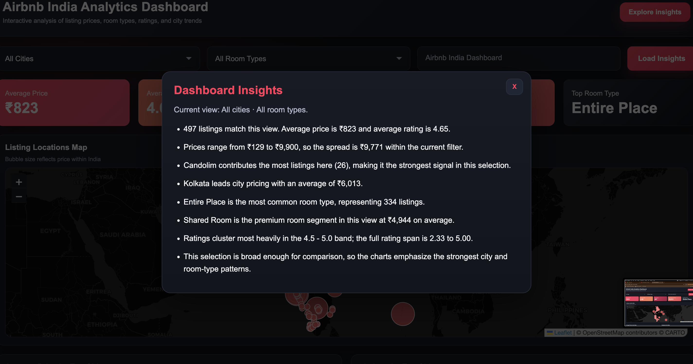
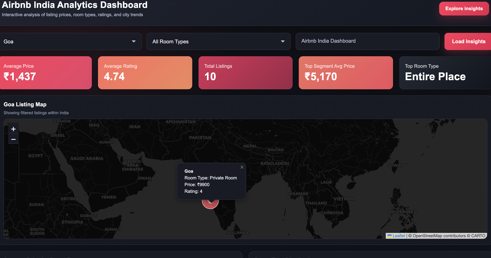
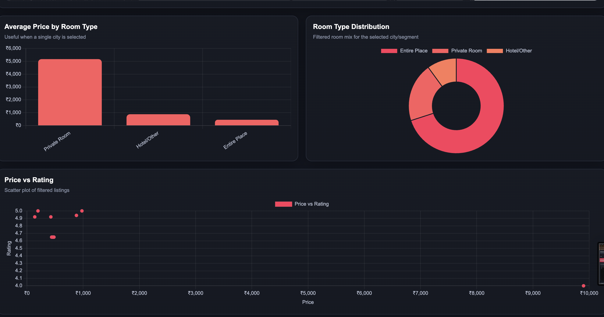
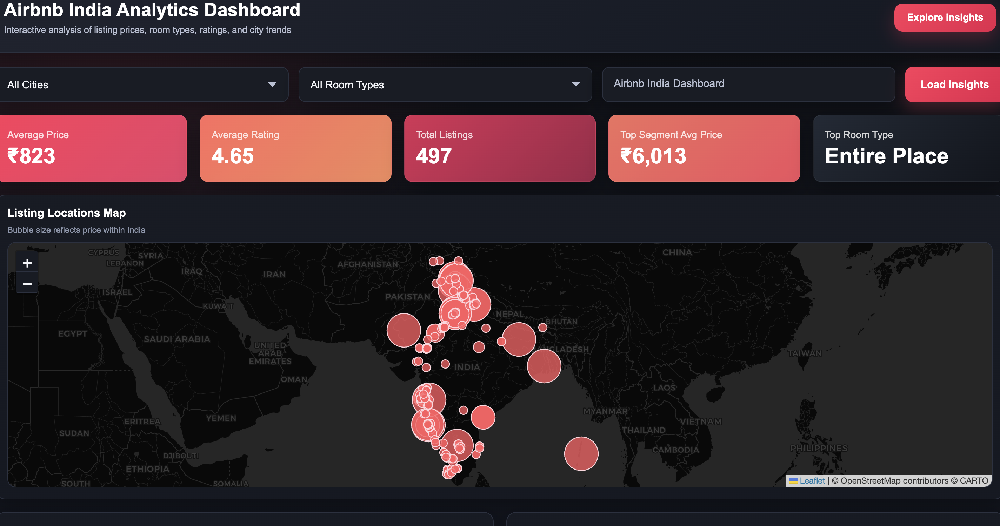

# Airbnb Dashboard

Airbnb Dashboard is a data analytics and web dashboard project focused on exploring Airbnb listings, pricing patterns, location trends, and property-level insights using Python, cleaned CSV data, and Flask.

The project combines data analysis, dashboard reporting, and a simple Flask web application to present Airbnb market insights in a portfolio-friendly format.

## Live Demo

Not deployed. This project currently runs locally as a Flask application and is also presented through a Jupyter Notebook, PDF report, cleaned dataset, and dashboard screenshots.

## Preview

### Dashboard Screens

| Dashboard Home | Listings Overview |
|---|---|
|  |  |

| Pricing Insights | Location Analysis |
|---|---|
|  |  |

## Project Highlights

- Analyzes Airbnb listing data.
- Explores pricing patterns and property trends.
- Uses cleaned CSV data for analysis.
- Includes a Jupyter Notebook for exploratory data analysis.
- Includes a Flask web app for dashboard presentation.
- Includes HTML templates for frontend display.
- Provides dashboard screenshots for quick preview.
- Includes a PDF report/export.
- Suitable for Data Analyst, Python Developer, and BI fresher portfolios.

## Tech Stack

- Python
- Flask
- Pandas
- Jupyter Notebook
- HTML
- CSS
- CSV
- Data Cleaning
- Data Analysis
- Data Visualization
- Dashboard Reporting

## Dataset

The included cleaned dataset is:

```text
airbnb_cleaned.csv
```

The dataset contains Airbnb listing information used to analyze property trends, pricing behavior, and location-based insights.

## Main Files

```text
Airbnb.ipynb                Jupyter Notebook with analysis workflow
app.py                      Flask application file
airbnb_cleaned.csv          Cleaned Airbnb dataset
Photo.pdf                   Dashboard/report export
requirements.txt            Python dependencies
README.md                   Project documentation
templates/                  HTML templates for the web app
airbnb_screenshot_01.png    Dashboard screenshot
airbnb_screenshot_02.png    Dashboard screenshot
airbnb_screenshot_03.png    Dashboard screenshot
airbnb_screenshot_04.png    Dashboard screenshot
```

## Analysis Approach

The project follows a practical data analytics workflow:

1. Load the cleaned Airbnb dataset
2. Review dataset structure and key columns
3. Analyze listing and pricing patterns
4. Explore location-based trends
5. Create visual summaries and dashboard outputs
6. Build a simple Flask dashboard
7. Present insights through screenshots and report files

## Main Features

### Airbnb Listing Analysis

The project studies Airbnb listing data to understand property distribution, listing behavior, and market patterns.

### Pricing Insights

The analysis explores pricing trends and helps identify how property and location factors may affect listing prices.

### Location-Based Analysis

The dashboard highlights location-related patterns to better understand Airbnb market concentration and availability.

### Flask Dashboard

The project includes a simple Flask app through `app.py`, with frontend files stored in the `templates/` folder.

### Dashboard Reporting

The repository includes dashboard screenshots and a PDF report for easy project review.

## Project Structure

```text
airbnb-dashboard/
├── templates/
├── Airbnb.ipynb
├── Photo.pdf
├── README.md
├── airbnb_cleaned.csv
├── airbnb_screenshot_01.png
├── airbnb_screenshot_02.png
├── airbnb_screenshot_03.png
├── airbnb_screenshot_04.png
├── app.py
└── requirements.txt
```

## Setup

Clone the repository:

```bash
git clone https://github.com/Sagnik0910/airbnb-dashboard.git
cd airbnb-dashboard
```

Install dependencies:

```bash
pip install -r requirements.txt
```

If needed, install common analysis libraries:

```bash
pip install pandas matplotlib seaborn flask jupyter
```

## Run the Flask App

```bash
python app.py
```

Open the local app in your browser:

```text
http://127.0.0.1:5000
```

## Open the Notebook

```bash
jupyter notebook Airbnb.ipynb
```

## How To View The Dashboard

Open the PDF report:

```text
Photo.pdf
```

Or view the dashboard screenshots directly in the repository:

```text
airbnb_screenshot_01.png
airbnb_screenshot_02.png
airbnb_screenshot_03.png
airbnb_screenshot_04.png
```

## Example Use Cases

- Airbnb listing analysis
- Pricing trend analysis
- Location-based market insights
- Data analyst portfolio project
- Flask dashboard practice
- Exploratory data analysis practice
- Business intelligence reporting
- Real estate and rental market analytics

## Current Limitations

- The project is not deployed publicly.
- The dashboard currently runs locally.
- Analysis depends on the available cleaned dataset.
- Dashboard interactivity may be limited.
- More advanced filtering and map-based analysis can be added.

## Future Improvements

- Deploy the Flask dashboard publicly.
- Add interactive filters for location, price, and room type.
- Add map-based listing visualization.
- Add more detailed business insights.
- Add SQL-based analysis queries.
- Improve dashboard UI and responsiveness.
- Add charts directly inside the README.
- Add an executive summary section.

## Author

Sagnik Guha

GitHub: [Sagnik0910](https://github.com/Sagnik0910)
